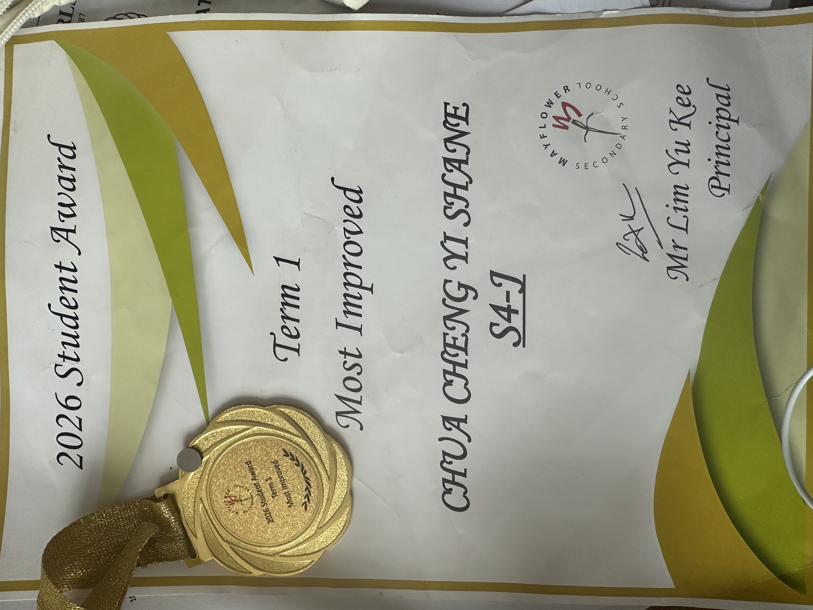
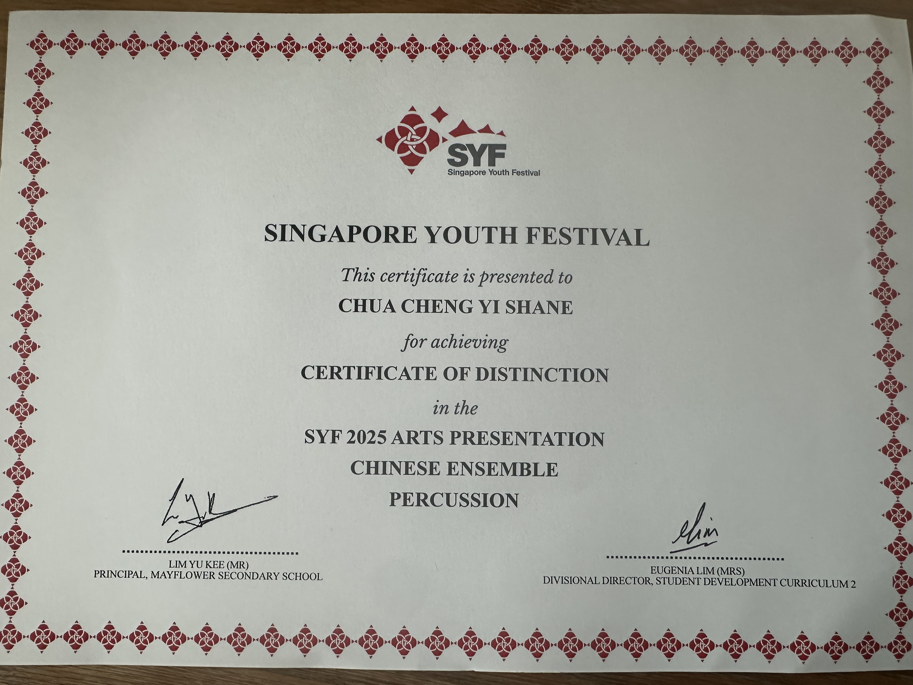

# EAE-portfolio-

An Early Admissions Exercise (EAE) portfolio for Accountancy / Banking & Finance applicants.

## View Portfolio

🔗 **[View my EAE Portfolio](https://chuas9302-gif.github.io/EAE-portfolio-/)**

## About

This portfolio showcases:
- **Entrepreneurship** - Carousell business experience
- **Leadership** - 4 years as Subject Representative
- **CCA** - Chinese Ensemble (SYF Distinction)
- **Community Service** - 50+ VIA hours
- **Achievements** - Key milestones and recognitions

## Features

- Responsive design
- Dark theme with gold accents
- Smooth navigation
- Clean, professional layout

## Achievements & Awards

### Proof of Recognition

#### 🏆 Singapore Youth Festival (SYF) 2025 - Certificate of Distinction
**Award:** Certificate of Distinction in Chinese Ensemble Percussion  
**Event:** SYF 2025 Arts Presentation  
**Category:** Chinese Ensemble - Percussion  
**Significance:** Recognized for excellence in percussion performance during the Singapore Youth Festival

---

#### 🥇 2026 Student Award - Most Improved
**Award:** Term 1 Most Improved Student  
**Class:** S4-J  
**School:** Mayflower Secondary School  
**Recognition:** Awarded for significant academic and personal improvement during Term 1, 2026

